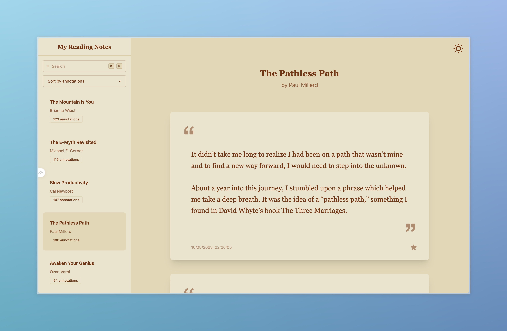

# Reading Notes

A simple application to manage and display book annotations.

## Why

I love reading books. I own a kobo and have many epub books. I usually highlight passages that I like but until now it has not being easy to consult them.

This is a simple app to read book annotations.



## Features
- Parse and display book annotations
- Clean and simple paper-like interface
- Sort and search annotations by date, title, author, and number of annotations

## Tech Stack
- Nuxt 3
- TailwindCSS 4
- DaisyUI 5

## Setup

1. Clone the repository:
```bash
git clone https://github.com/looer/reading-notes.git
cd reading-notes
```

2. Install dependencies:
```bash
npm install
```

3. Run the development server:
```bash
npm start
```

## Using Your Own Annotations

Replace the annotations in the `data/annotations` directory

## Sample Data
The `data/annotations` directory contains my annotations to demonstrate the application's functionality.

## Project Structure
- `app/`: Application source code
- `data/`: Annotation files
  - `annotations/`: Your annotations 